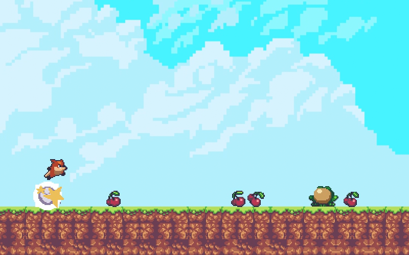

# for-the-foxes

For The Foxes is a sample game made in Godot 4 which includes collecting cherries and avoiding frog enemies.

This project was to learn Godot, and can be recreated by following this great tutorial: https://youtu.be/S8lMTwSRoRg

## Screenshot

